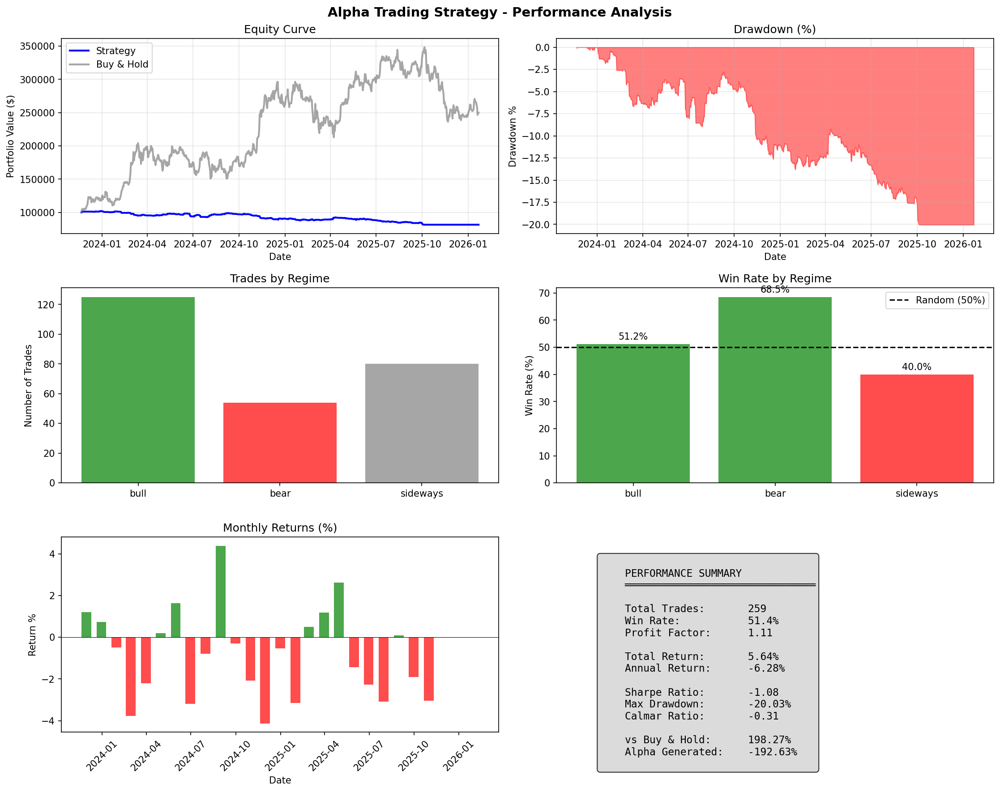
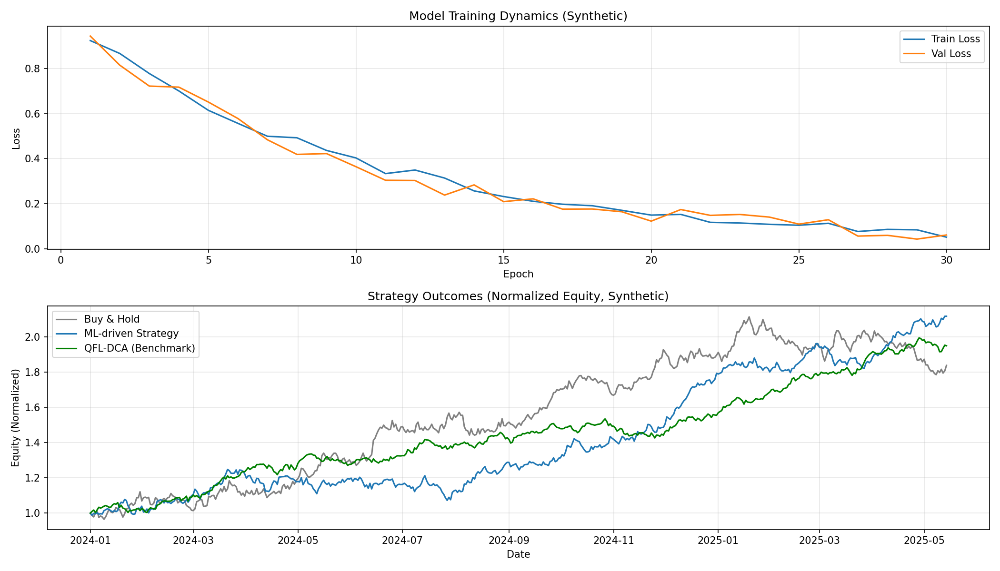
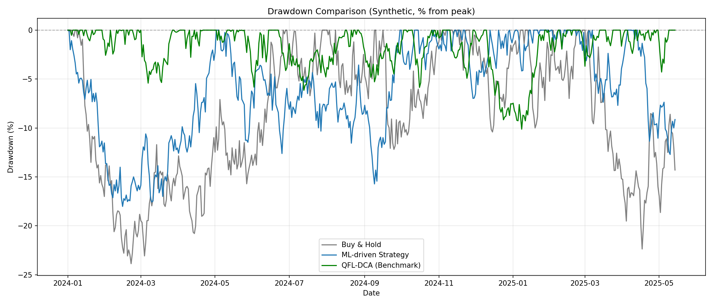
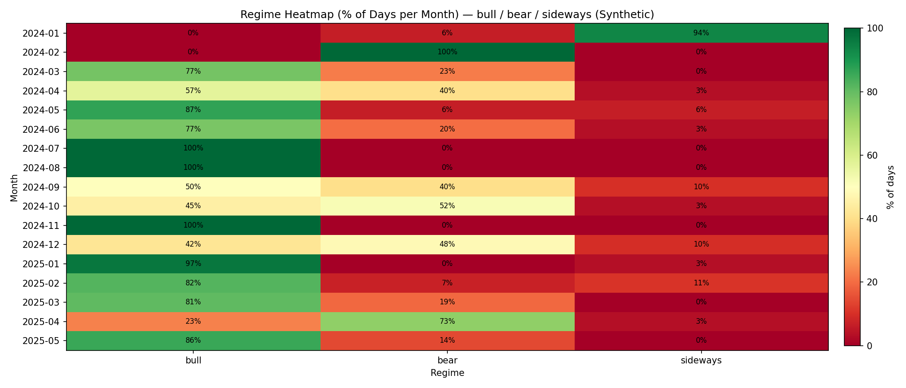

# bitcoin-timeseries-ml-engineering

Bitcoin time-series ML engineering project (IBM AI Engineering Certificate): **LSTM variants + walk-forward validation + reporting dashboards**, with **private alpha redaction** and **synthetic CI reproducibility**.

**IBM AI Engineering Certificate Alignment:** Demonstrates time-series data handling, leakage prevention, deep learning architectures (LSTM/BiLSTM/Attention), and comprehensive evaluation—core competencies for production ML systems.

---

## Results at a Glance

- Walk-forward validation pipeline with leakage-safe preprocessing
- ML metrics and trading-aware metrics generated per run
- Synthetic CI path validates full pipeline end-to-end
- Real results depend on dataset, regime, and configuration
- All metrics are written to `outputs/metrics.json` and `outputs/metrics.txt`
- This repo demonstrates **evaluation rigor**, not alpha disclosure

> **Boundary (non-negotiable):** proprietary trading datasets, QFL-DCA rules/parameters, and any "alpha discoveries" are intentionally **not published**.  
> This repo is designed to demonstrate **engineering discipline, evaluation rigor, and reporting**, not to release a deployable trading system.

---

## Project Scope

This repository implements an end-to-end pipeline for **Bitcoin forecasting experiments**:

- **Time-series-safe splits** (chronological + optional walk-forward evaluation)
- **Leakage-resistant scaling** (fit scalers on train split only)
- **Deep sequence models** (LSTM / BiLSTM / Attention / CNN-BiLSTM-Attention)
- **Evaluation** with both:
  - ML metrics (MSE/RMSE/MAE/MAPE/R²)
  - Trading-aware metrics (directional accuracy, Sharpe, drawdown, profit factor, Calmar, etc.)
- **Reproducible runs** (config-driven CLI + CPU-safe CI smoke test)

---

## What this repo is NOT

- Not a "copy-paste profitable strategy"
- Not a dump of trade logs or private datasets
- Not a release of QFL-DCA rule logic, thresholds, or optimization research
- Not financial advice

---

## Reporting & Visual Analysis

This project includes a reporting layer intended to make results **auditable and comparable**.

### Strategy Performance Dashboard (example)



**What this dashboard highlights:**
- Equity curve vs Buy & Hold
- Drawdown profile
- Trades and win-rate by regime (bull/bear/sideways)
- Monthly return distribution
- Summary risk metrics (Sharpe, MaxDD, Calmar, Profit Factor)

> If you don't see this image render, ensure the file exists at:
> `docs/images/strategy_performance.png`

### Model Training vs Strategy Outcomes

A core principle in this repo: **better predictive loss does not automatically translate into better trading performance**.
Execution constraints, regime shifts, costs, and capital deployment dominate real outcomes.



**Interpretation guidance:**
- Lower validation loss ≠ better trading performance
- QFL-DCA may outperform ML due to execution discipline
- ML is best positioned as a **signal enhancer**, not a standalone strategy

### Drawdown Comparison (Buy & Hold vs ML vs QFL-DCA)



### Regime Heatmap (bull / bear / sideways)



---

## Comparative Evaluation: ML vs Buy & Hold vs QFL-DCA

This repo treats **Buy & Hold** and **QFL-DCA** as benchmarks for validating whether an ML signal adds real value.

| Approach | Purpose | Strengths | Typical Failure Mode |
|---|---|---|---|
| **Buy & Hold** | Baseline exposure | Captures long-cycle beta | Large drawdowns, regime risk |
| **ML Signal (LSTM variants)** | Forecasting / directional edge | Learns temporal patterns | Weak cross-cycle generalization; overfit risk |
| **QFL-DCA (benchmark)** | Capital deployment discipline | Drawdown control, structured entries | Requires strict risk management; rules are proprietary |

**Interpretation rule used here**
- If the ML strategy cannot beat **Buy & Hold** on risk-adjusted terms, it is not "production-ready."
- If QFL-DCA beats the ML strategy, the conclusion is:
  - ML is best used as a **signal enhancer**, not a standalone trading system.

> **Disclosure:** QFL-DCA implementation details are intentionally excluded. Only aggregated comparisons are shown.

---

## Privacy / Alpha Redaction Policy

Excluded from this public repo:
- Private datasets (`data/raw/`, trade logs, labeled outcomes)
- Private outputs (full experiment tables, matched trade histories)
- Proprietary strategy parameters / thresholds
- Full QFL-DCA optimization documents

Included:
- The **pipeline** and **engineering rigor**
- Config-driven training/evaluation
- Synthetic/public reproducibility path (CI-friendly)
- Aggregated reporting patterns and templates

---

## Repo Structure

```
.
├── src/
│   ├── data/            # feature engineering + processor (train-only scaling)
│   ├── models/          # LSTM architectures
│   ├── training/        # trainer + metrics + walk-forward
│   └── utils/           # utilities (sanitized)
├── tests/               # sanity checks
├── notebooks/           # optional exploration (sanitized)
├── docs/
│   └── images/          # charts/graphs used in README
├── scripts/             # helper scripts (chart generation, etc.)
├── config.public.yaml   # synthetic CI config (safe + fast)
├── main.py              # CLI entry point (train/evaluate)
├── requirements.txt
├── requirements.ci.txt
├── README.md
└── AGENT.md             # runbook (hardening + releases)
```

---

## Engineering Rigor Highlights

- **Time-series correctness:** chronological splits + walk-forward option (no random k-fold)
- **DataLoader rigor:** `shuffle=False` for temporal order preservation
- **Leakage control:** scalers fit on train only; persisted for inference
- **Checkpointing:** best model saved/reloaded for evaluation
- **Metrics coverage:** ML + trading-aware metrics
- **CI reproducibility:** synthetic data path to validate pipeline without private data

---

## CLI Contract

| Flag | Default | Description | Output Path |
|---|---|---|---|
| `--mode` | `train` | Operation: `train`, `evaluate`, `predict` | - |
| `--config` | `config.yaml` | Path to YAML config file | - |
| `--max_epochs` | `None` | Override epochs from config (optional) | - |
| `--days` | `7` | Days to predict (predict mode only) | - |

**Outputs (gitignored):**
- `models/best_model.pt` - Best model checkpoint
- `models/scalers.joblib` - Fitted scalers for inference
- `outputs/metrics.json` - Evaluation metrics (JSON)
- `outputs/metrics.txt` - Evaluation metrics (human-readable)
- `outputs/test_predictions.csv` - Test set predictions vs actuals

---

## Quick Start (Local)

### 1) Install
```bash
python -m venv .venv
source .venv/bin/activate
pip install -r requirements.txt
```

### 2) Run (Synthetic / CI-style)

This runs without any private data:

```bash
python main.py --mode train --config config.public.yaml --max_epochs 1
```

### 3) Bring Your Own Data (BYOD)

Provide a CSV with OHLCV daily bars.

Default expected path (gitignored):

* `data/raw/btc_ohlcv_daily.csv`

Train/evaluate:

```bash
python main.py --mode train --config config.yaml
python main.py --mode evaluate --config config.yaml
```

---

## Model Card

**Model Type:** LSTM / BiLSTM / CNN-BiLSTM-Attention (configurable)

**Inputs:**
- Time-series sequences (default: 30-60 timesteps)
- Features: OHLCV, technical indicators, optional on-chain metrics
- Sequence length: Configurable (default: 30 for CI, 60 for production)

**Assumptions:**
- Temporal patterns are learnable from historical sequences
- Market regimes are relatively stable within training window
- Feature distributions remain consistent (handled via scaling)

**Known Failure Modes:**
- Regime shifts: Model trained on bull market may fail in bear market
- Distribution drift: Feature distributions change over time (mitigated by walk-forward validation)
- Overfitting: High training accuracy with poor generalization (mitigated by early stopping + validation)
- Sequence length mismatch: Model expects fixed-length sequences; data gaps require handling

**Limitations:**
- Not suitable for high-frequency trading (designed for daily bars)
- Requires sufficient historical data (minimum ~500 samples for meaningful training)
- Performance degrades during extreme volatility events

---

## How to Add Your Own Charts

1. Put images in:

* `docs/images/`

2. Embed them in README:

```md

```

Recommended figures to add:

* Equity curve comparison (Buy & Hold vs ML vs QFL-DCA)
* Drawdown comparison (same three lines)
* Regime breakdown (performance by bull/bear/sideways)
* "Model loss vs strategy returns" (shows optimization ≠ trading success)

---

## Safety / Compliance

Educational / research use only.
No financial advice. Use at your own risk.

---

## License

**MIT License** - See [LICENSE](LICENSE) file for details.
